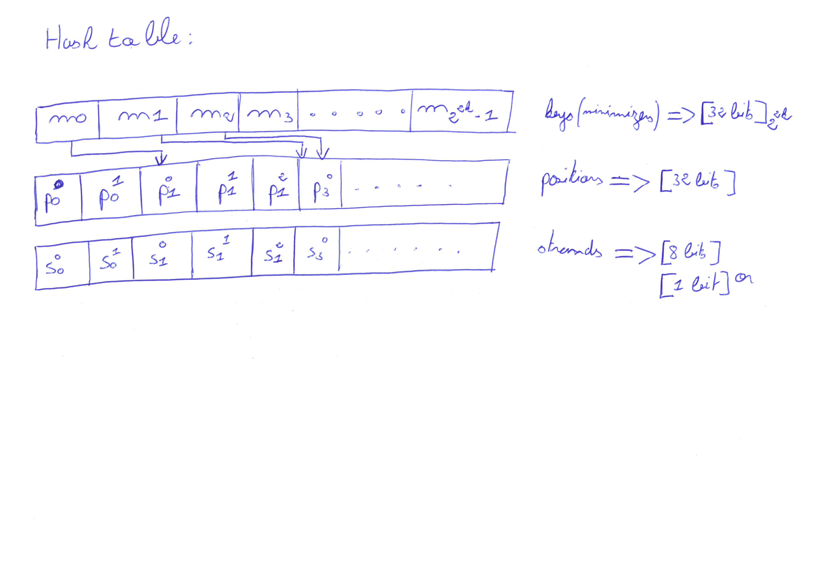

= FPGA_Genome_Indexing

FPGA Genome Indexing &amp; Seeding (Julien Eudine)

== Installation

Clone the repository & build the program:
[source, shell]
----
git clone git@github.com:jeudine/genome_indexing.git
cd genome_indexing && make
----

== Usage

=== Seed extraction and indexing from the reference genome

[source, shell]
----
./main -k <k-mer length> -w <window size> -f <frequency threshold> -b <size of the mask> <Genome reference filename (.fna)> <Output binary file>
----

The default values for `k`, `w`, `f` and `b` are 18, 12, 500 and 26 respectively.

Two output binary formats can be generated:

* The default structure consists of 3 arrays. In the first array, each entry corresponds to a minimizer and contains an index of the two other arrays. The two arrays contain the sets of locations & strands corresponding to a given minimizer.
* A sorted array of the following triplet (minimizer, position, strand). Each element is encoded on 72bits. To output this format you have to use the `-r` option.

.A representation of the default data structure

=== Seed extraction, querying and filtering from reads

[source, shell]
----
./main -k <k-mer length> -w <window size> -b <size of the mask> -m <Minimizer threshold> -l <Location range> -i <Binary reference genome index> <Reads file (.fastq)> > output
----

The default values for `k`, `w`, `b`, `m` and `l` are 18, 12, 26, 4 and 200 respectively.

To compare the mapping locations with a mapping positions file, you can add the option `-c <mapping positions file (.paf)>`. This option only compares both mappings and doesn't output the mapping file.

== Reports

In all the following results link:https://www.ncbi.nlm.nih.gov/assembly/GCF_000001405.39[GRCh38.p13] (3,209,286,105 bases) is used as the genome reference.

* *https://github.com/mealser/FPGA_Genome_Indexing/blob/main/reports/week5.adoc[week5]*
* *https://github.com/mealser/FPGA_Genome_Indexing/blob/main/reports/week4.adoc[week4]*
* *https://github.com/mealser/FPGA_Genome_Indexing/blob/main/reports/week3.adoc[week3]*
* *https://github.com/mealser/FPGA_Genome_Indexing/blob/main/reports/week2.adoc[week2]*
* *https://github.com/mealser/FPGA_Genome_Indexing/blob/main/reports/week1.adoc[week1]*
