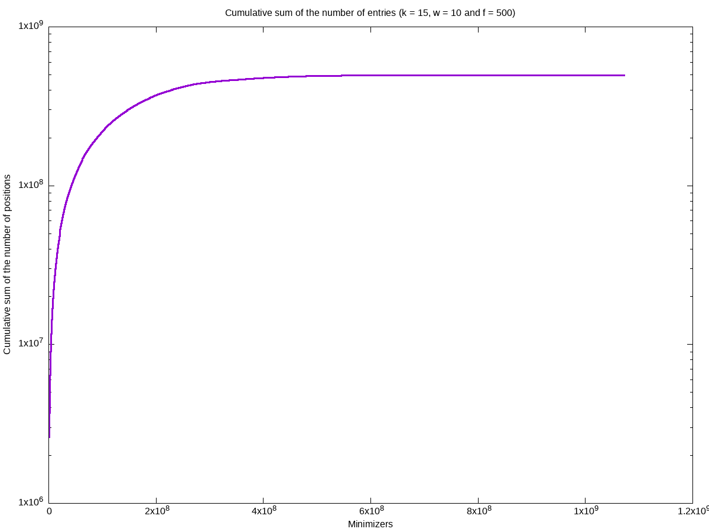
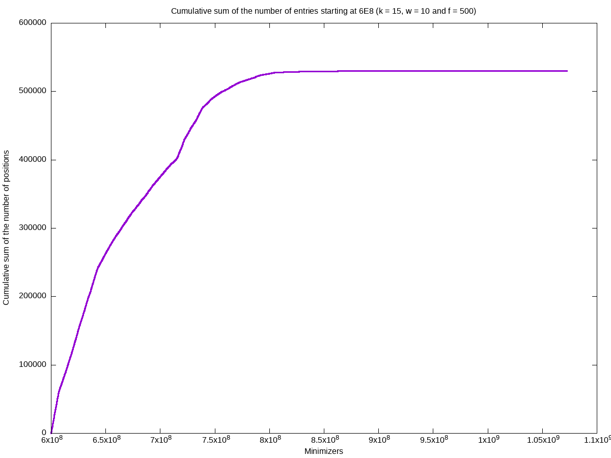
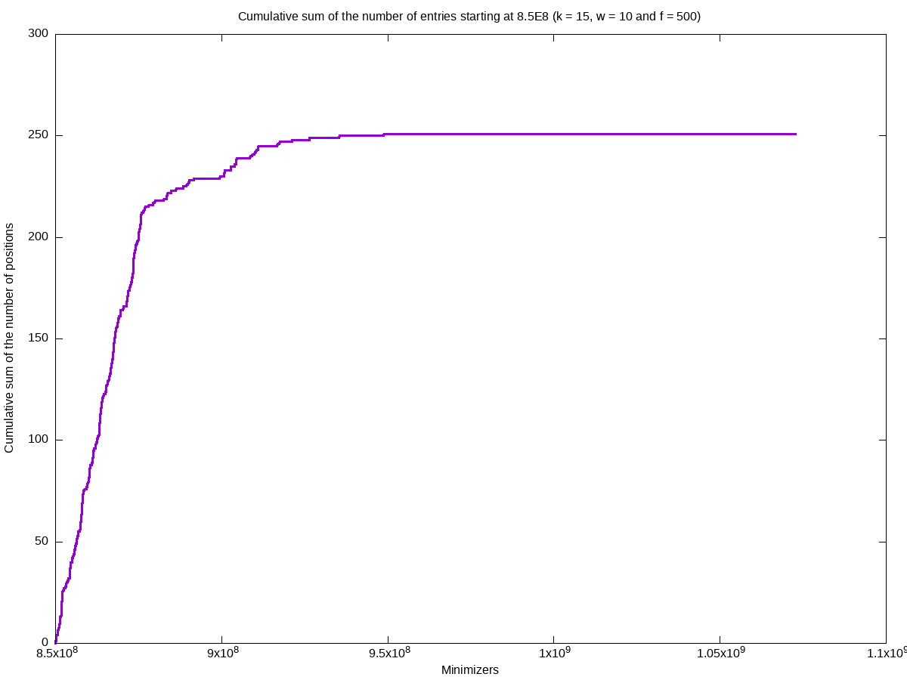

= Genome indexing

== Installation

Clone the repository & build the program:
[source, shell]
----
git clone git@github.com:jeudine/genome_indexing.git
cd genome_indexing && make
----

== Usage

[source, shell]
----
./main -k <k-mer length> -w <window size> -f <frequency threshold> -b <size of the mask> <Genome reference filename (.fna)> <Output binary file>
----

The default values for `k`, `w`, `f` and `b` are 15, 10, 500 and 28 respectively.

Two output binary formats can be generated:
* The default structure consist of 3 arrays. In the first array, each entry corresponds to a minimizer and contains an index of the two other arrays. The two arrays contain the sets of locations & strands corresponding to a given minimizer.
* A sorted array of the following triplet (minimizer, position, strand). To output this format you have to use the `-r` option.

.A representation of the default data structure
image::img/schematic.png[schematic]

== Results

In all the following results link:https://www.ncbi.nlm.nih.gov/assembly/GCF_000001405.39[GRCh38.p13] (3,209,286,105 bases) is used as the genome reference.

=== Week 1

==== w: 10, k:13
[cols="1,1"]
|===
|Number of (minimizer, position, strand)
|576,283,952
|Number of distinct minimizers
|14,192,855
|Size of the position array
|2.146825GB
|Size of the strand array
|0.536706GB
|Size of the minimizer array
|0.250000GB
|Total size
|2.933531GB
|===

==== w: 10, k:14
[cols="1,1"]
|===
|Number of (minimizer, position, strand)
|569,523,410
|Number of distinct minimizers
|40,737,512
|Size of the position array
|2.121640GB
|Size of the strand array
|0.530410GB
|Size of the minimizer array
|1.000000GB
|Total size
|3.652050GB
|===

==== w: 10, k:15
[cols="1,1"]
|===
|Number of (minimizer, position, strand)
|574,381,278
|Number of distinct minimizers
|100,202,295
|Size of the position array
|2.139737GB
|Size of the strand array
|0.534934GB
|Size of the minimizer array
|4.000000GB
|Total size
|6.674671GB
|===

==== w: 9, k:14
[cols="1,1"]
|===
|Number of (minimizer, position, strand)
|626,106,566
|Number of distinct minimizers
|44,112,343
|Size of the position array
|2.332429GB
|Size of the strand array
|0.583107GB
|Size of the minimizer array
|1.000000GB
|Total size
|3.915536GB
|===

==== w: 11, k:14
[cols="1,1"]
|===
|Number of (minimizer, position, strand)
|522,709,699
|Number of distinct minimizers
|37,843,165
|Size of the position array
|1.947245GB
|Size of the strand array
|0.486811GB
|Size of the minimizer array
|1.000000GB
|Total size
|3.434057GB
|===

=== Week 2

* Output a binary file containing the hash-table
* Possibility to ignore the most frequent minimizer (`-f <Frequency threshold>`)
* Command line options
* Plots (`-p`) & logs showing the distribution of the number of entries
* Optimize the number of minimizers (`<2^(2k)`)
* Winnowmap W.I.P.

Example of logs:
[source, shell]
----
Info: w = 10, k = 15 & f = 500
Info: Indexed DNA length: 3209286105 bases
Info: Number of (minimizer, position, strand): 574381278
Info: Maximum minimizer: 1072721685
Info: Array sorted
Info: Number of ignored minimizers: 30061
Info: Number of distinct minimizers: 100172234
Info: Size of the position array: 1.842147GB
Info: Size of the strand array: 0.460537GB
Info: Size of the minimizer array: 3.996200GB
Info: Total size: 6.298883GB
Info: Number of empty entries in the hashtable: 972549452 (90.661865%)
----

*As we can notice, the index-map is sparse (`90.66%` of empty entries) but use a lot of memory (`3.996200GB`). Let us take a look at the distribution depending on the minimizers.*

== Questions
* How to reduce the size of the hash table?

If we only use *index mapping*, for k = 18, we could have a minimizer equal to `2^(36) - 1`, in this case size of the hash-table 256 GB.
But *index mapping* is fast (access time: O(1) and only 2 memory accesses).

Solution:

Second part of the index is sparse and probability to access it is smaller: *store the two parts of the hash-table in different ways & access the second part as less as possible (test the adjacency first for the small minimizers and then more accurately with big minimizers (using a threshold)).*

Use *COO* (Coordinate list c.f. sparse matrix on wikipedia) for the second part of the hash-table (access: O(log(n)))
