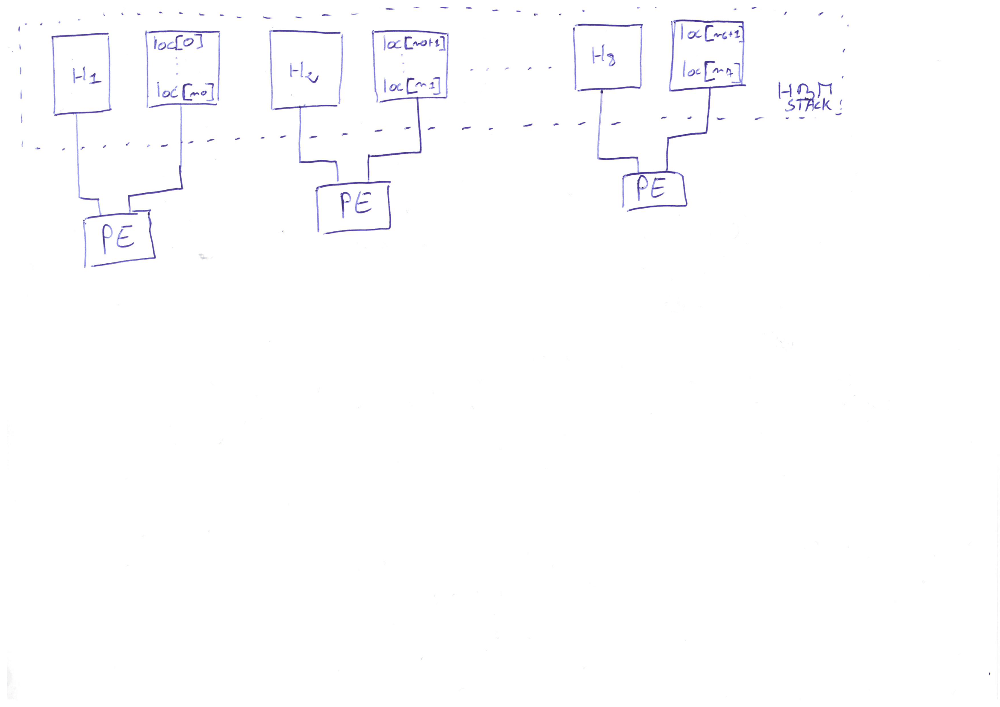

= Week 11

== TO DO

* Generate the Bitstream
* Implement the host program
* Partition the index
* Continue TaPaSCo implementation

== Achievements

* Partitioning of the index to fit into the memory sections
** Enables a more accurate filtering of the minimizers with a lot of locations
** Not need to replace the LSbit of the location by the strand ({location, strand} fits on 32 bits)

* Size of the buffer optimized
* Bitstream generation successful (@ 150 MHz)

== Results

* Bitstream

== Questions
