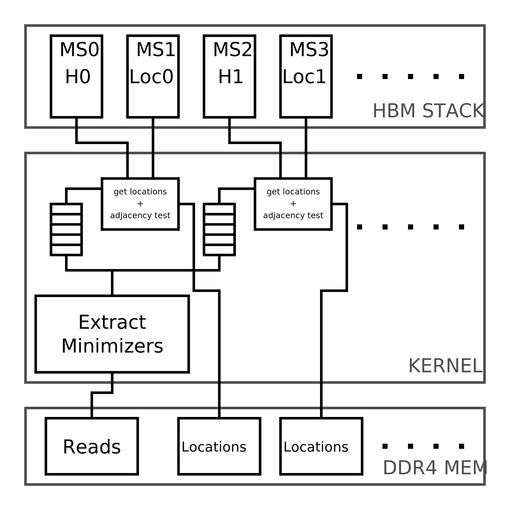
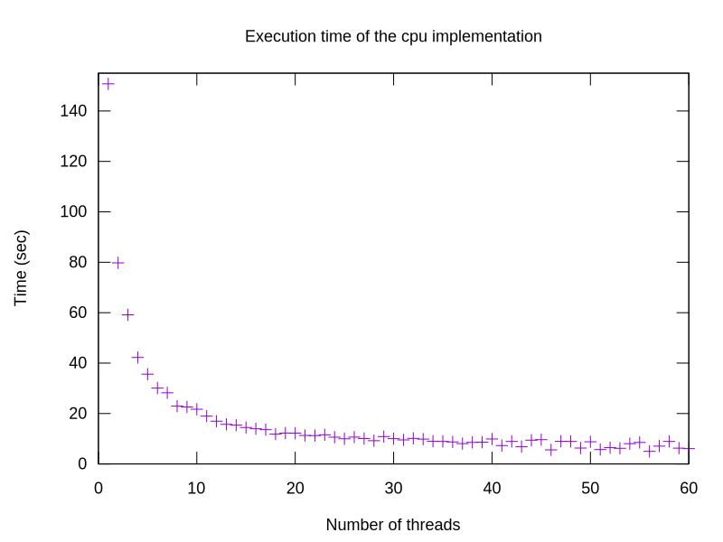
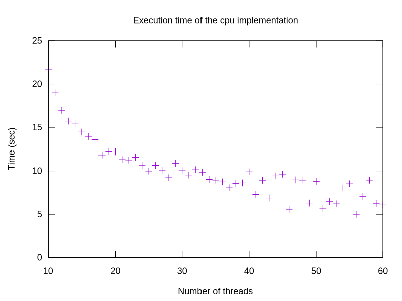

= Week 12

== TO DO

* Implement the host program
* Take a look at the alignment algorithms
* Use several HBM sections for the FPGA implementation
* Schematic
* Smart partition of the Index
* Test the CPU implementation on the supercomputers
* Solution for reads with variable length
* CPU implementation: translate the reads before

== Achievements

* Use several HBM sections for the FPGA implementation
* Test the CPU implementation on nexus0 (with 60 CPUs)
* Smart partition of the Index for FPGA implementation

== Results

.4093747 reads, 100 bases, full DNA, k18, w12, f2000, b26, min_t3, loc_r150, nexus0

.4093747 reads, 100 bases, full DNA, k18, w12, f2000, b26, min_t3, loc_r150, nexus0 ZOOMED

== Questions
