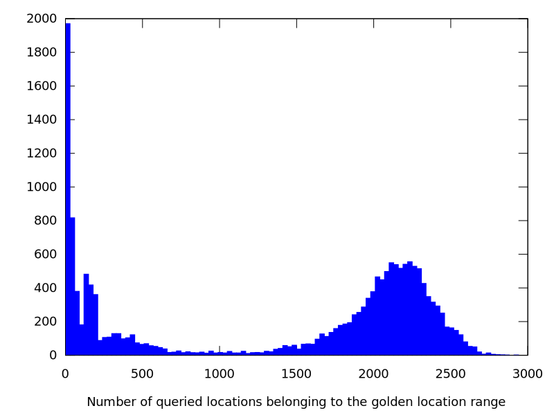
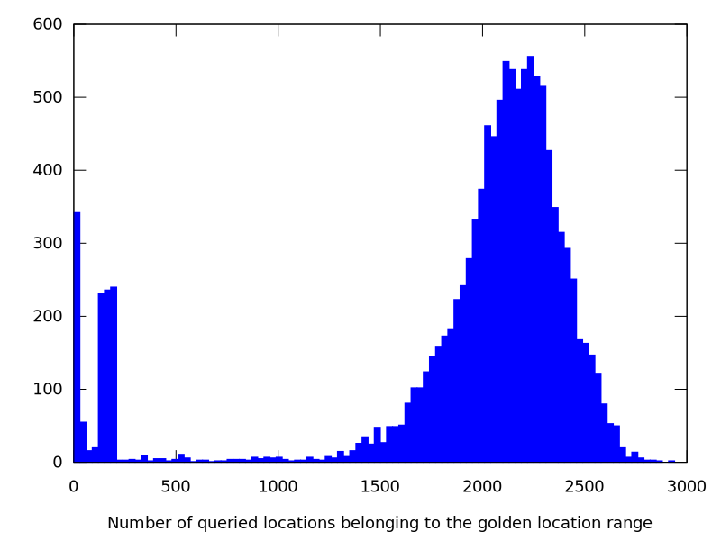
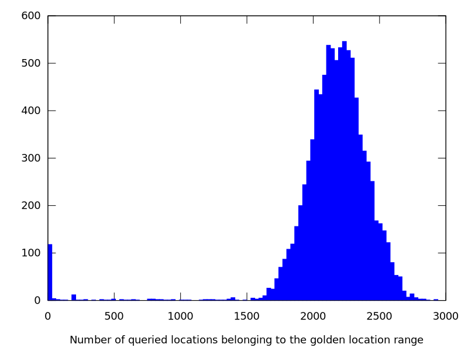

= Week 14
:stem:

== TO DO

* Plot distributions
* Outline final report

== Achievements

* Sensitivity test (written in Rust) with a Pacbio dataset
* Outline for the final report
* FPGA implementation improved with batch reading & new stage added to increase the throughput
* CPU implementation improved by reducing the number of "mallocs"

== Results
* BLAST-like alignment identity (_Blai_) = stem:[("number of matching bases in the mapping")/("number of sequence matches, mismatches and gaps in the alignment")]
* Dataset: 10,000 pacbio reads
* Golden model: _Minimap2_

.Distribution of the number of valid locations per read

.Distribution of the number of valid locations per read (Blai >= 0.5)

.Distribution of the number of valid locations per read (Blai >= 0.8)

== Questions

* According to the plots which threshold for adjacency test?
