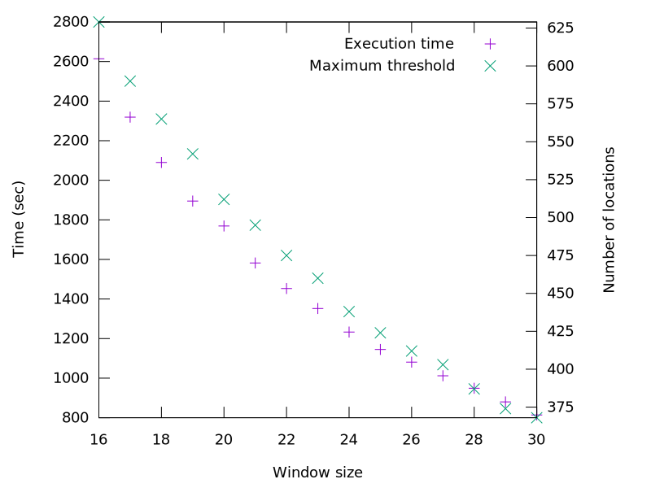

= Week 15
:stem:

== TO DO

* Find the best parameters
* Estimation of the performances of the FPGA implementation

== Achievements

* test bench to find the best parameters
* Outline for the final report

== Results

=== Test bench

==== INPUT

*Wref*, *Wread*, *k*

==== OUTPUT

*Execution time*, *Threshold for adjacency filtering*, *Number of false positive*

.Execution time and threshold depending on the window size (wref: 16)

== Questions
* Filtering in test bench?
* Same window for ref. and read ?
