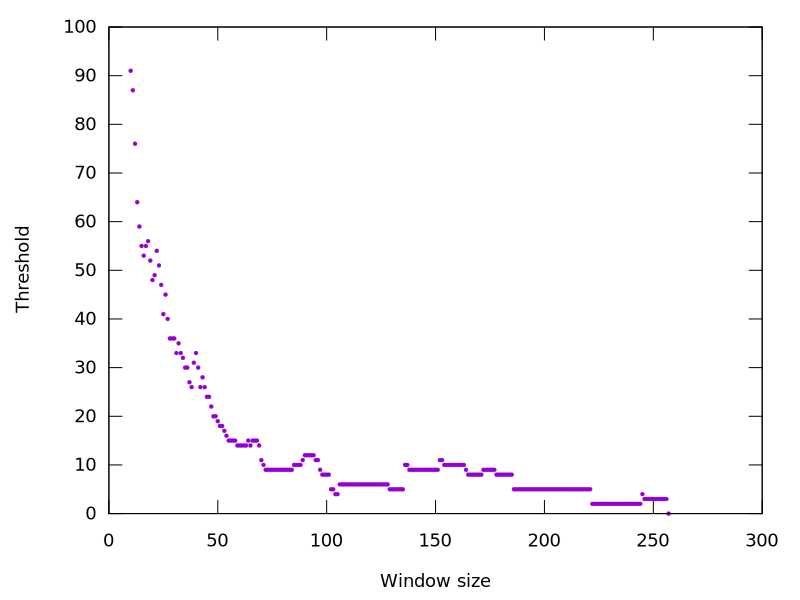
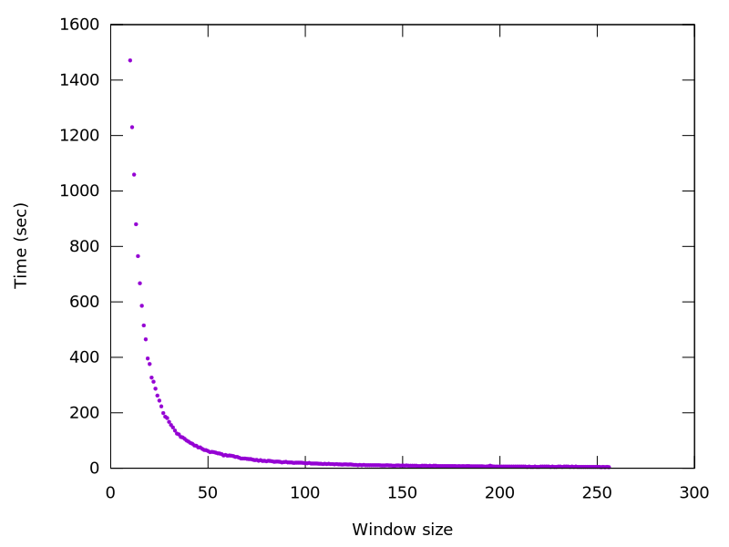
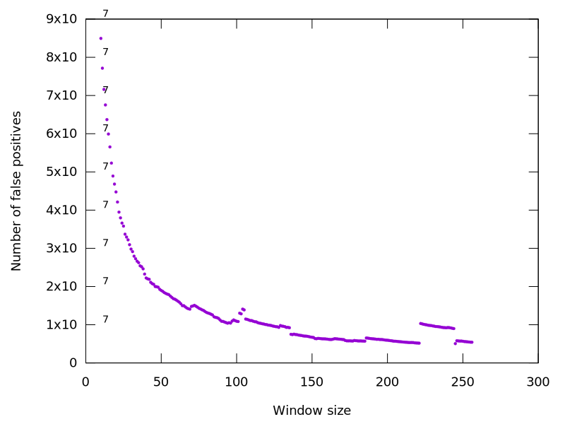
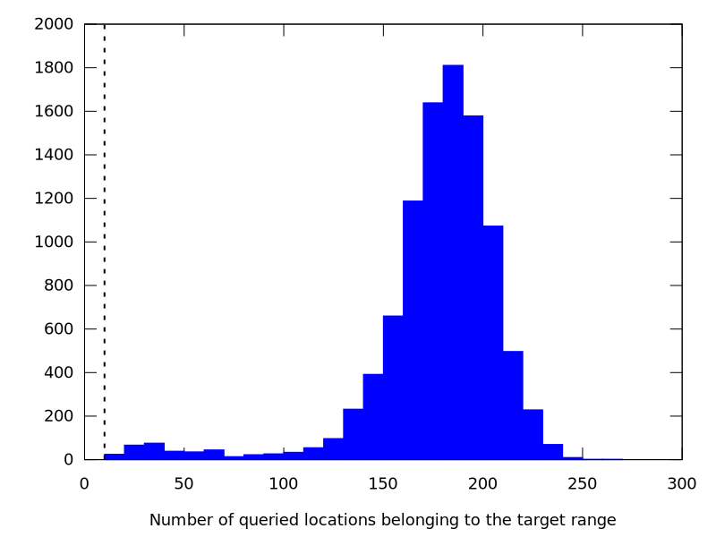

= Week 16
:stem:

== TO DO

* Find the best parameters

== Results
* Dataset: Pacbio 10000 reads

.Maximum threshold for adjacency filtering to get 0 false negatives

.Execution time

.Number of false positives

[cols=5*,options=header]
|===
|Sequencing tool
| k (Extraction)
| w (Extraction)
| threshold (AF)
| range (AF)

| Illumina
| 18
| 12
| 3
| 110 bases

| Pacbio
| 19
| 152
| 10
| 110% of the read len
|===

.Distribution of the number of good locations per reads (Pacbio, Primary aln)

.Distribution of the number of good locations per reads (Pacbio, Secondary aln)
image::../img/week16/counter_s.svg[]

== Questions
