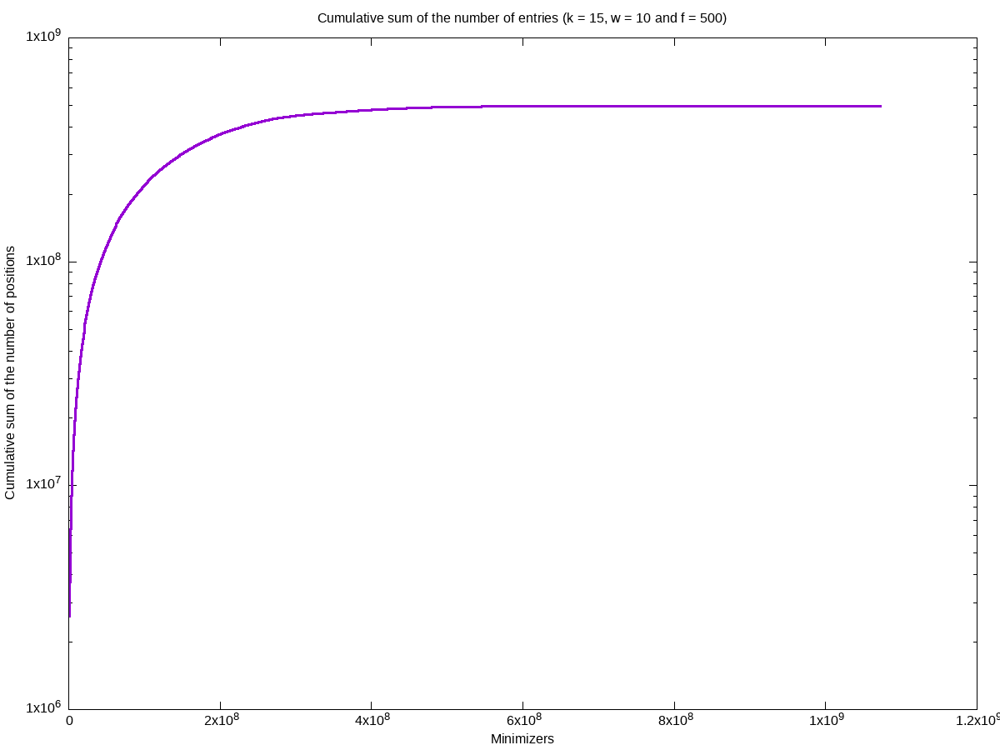
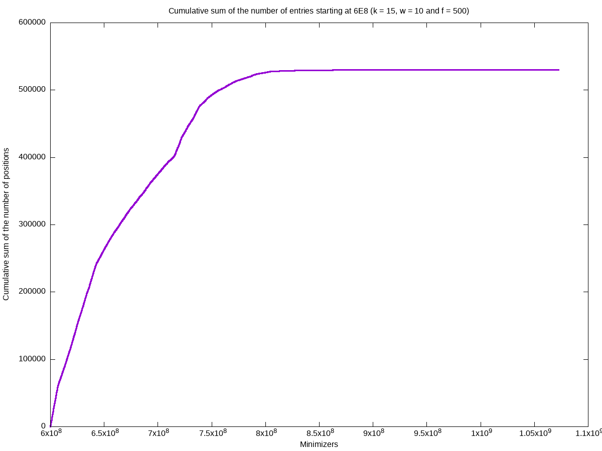
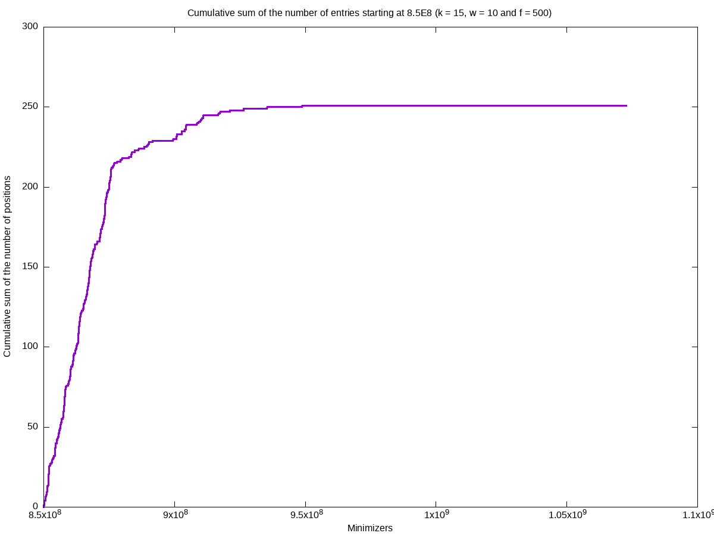

= Week 2

== Achievements

* Output a binary file containing the hash-table
* Possibility to ignore the most frequent minimizer (`-f <Frequency threshold>`)
* Command line options
* Plots (`-p`) & logs showing the distribution of the number of entries
* Optimize the number of minimizers (`<2^(2k)`)
* Winnowmap W.I.P.

== Results

Example of logs:
[source, shell]
----
Info: w = 10, k = 15 & f = 500
Info: Indexed DNA length: 3209286105 bases
Info: Number of (minimizer, position, strand): 574381278
Info: Maximum minimizer: 1072721685
Info: Array sorted
Info: Number of ignored minimizers: 30061
Info: Number of distinct minimizers: 100172234
Info: Size of the position array: 1.842147GB
Info: Size of the strand array: 0.460537GB
Info: Size of the minimizer array: 3.996200GB
Info: Total size: 6.298883GB
Info: Number of empty entries in the hashtable: 972549452 (90.661865%)
----

*As we can notice, the index-map is sparse (`90.66%` of empty entries) but use a lot of memory (`3.996200GB`). Let us take a look at the distribution depending on the minimizers.*

== Questions

* How to reduce the size of the hash table?

If we only use *index mapping*, for k = 18, we could have a minimizer equal to `2^(36) - 1`, in this case size of the hash-table 256 GB.
But *index mapping* is fast (access time: O(1) and only 2 memory accesses).

Solution:

Second part of the index is sparse and probability to access it is smaller: *store the two parts of the hash-table in different ways & access the second part as less as possible (test the adjacency first for the small minimizers and then more accurately with big minimizers (using a threshold)).*

Use *COO* (Coordinate list c.f. sparse matrix on wikipedia) for the second part of the hash-table (access: O(log(n)))
