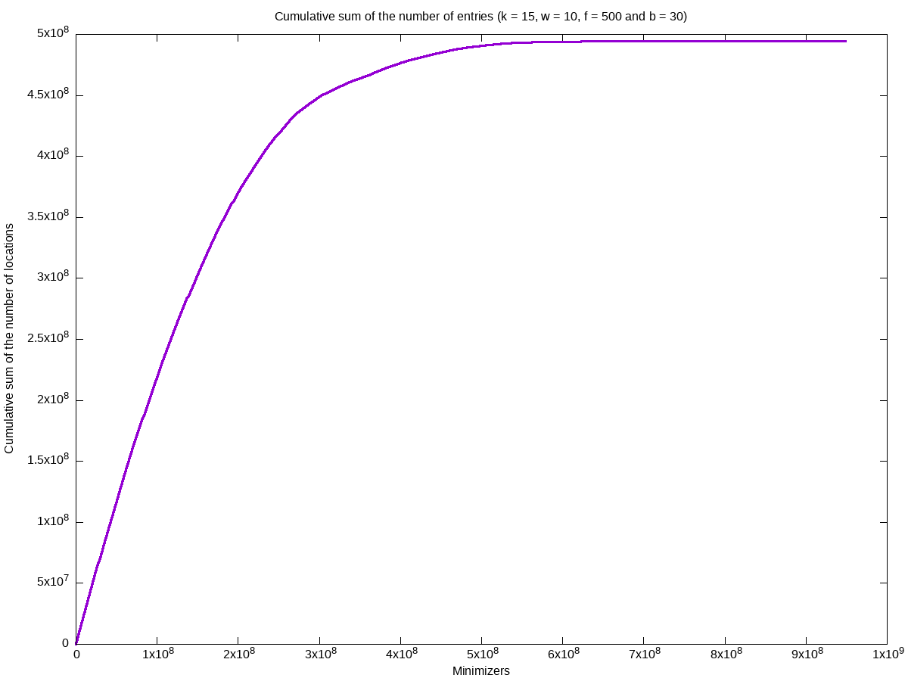
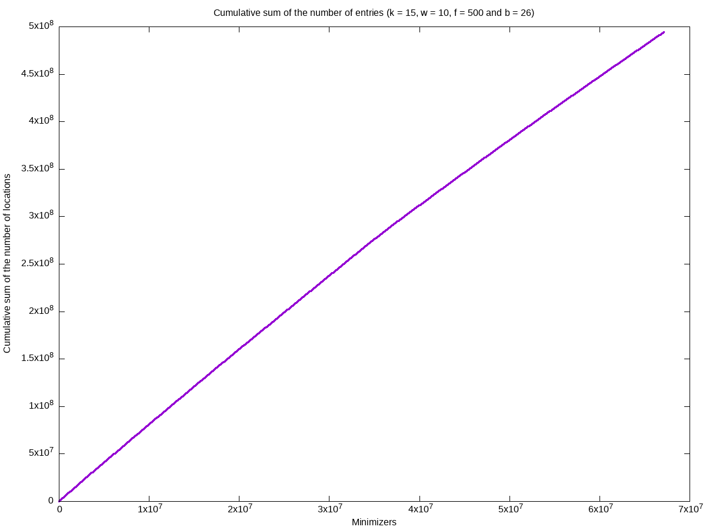
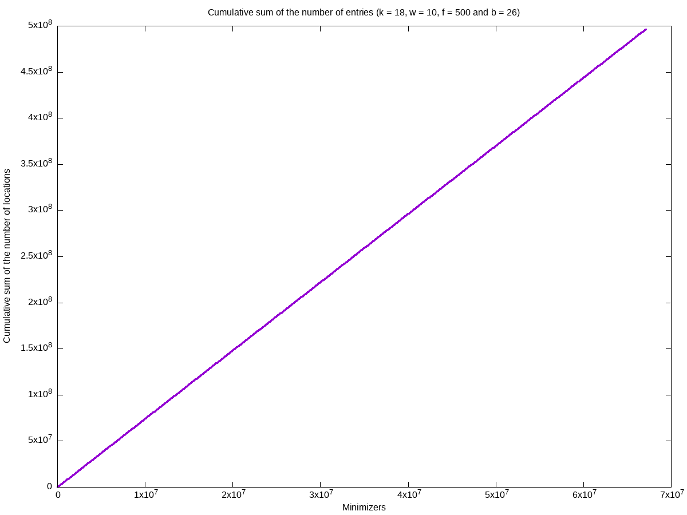

= Week 3

== Achievements

* Reduction of the size of the minimizer array until the biggest *non ignored* minimizer.
* Sorted (minimizer, position, strand) array can be used as output format.
* Add a mask to reduce the number of minimizers in the hash-table.
* Log the average & the standard deviation of locations per minimizers.
* Speed of program improved using multiple threads.
* Queries almost done

== Results

=== Mask influence (`b`)

==== k = 15

===== b = 30
[source, shell]
----
Info: w = 10, k = 15, f = 500 & b = 30
Info: Total size: 5.837307GB
Info: Average locations per minimizers: 0.521172
Info: Standard deviation of the number of locations per minimizers: 3.713472
Info: Number of empty entries in the hash-table: 848646020 (89.442421%)
----

===== b = 28
[source, shell]
----
Info: w = 10, k = 15, f = 500 & b = 28
Info: Total size: 3.302581GB
Info: Average locations per minimizers: 1.842065
Info: Standard deviation of the number of locations per minimizers: 6.874097
Info: Number of empty entries in the hash-table: 176228873 (65.650375%)
----

image::../img/week3/cumulative1.png[../img/week2/cumulative1]

===== b = 26
[source, shell]
----
Info: w = 10, k = 15, f = 500 & b = 26
Info: Total size: 2.551074GB
Info: Average locations per minimizers: 7.363437
Info: Standard deviation of the number of locations per minimizers: 13.542623
Info: Number of empty entries in the hash-table: 11889415 (17.716608%)
----

==== k = 18

===== b = 28

[source, shell]
----
Info: w = 10, k = 18, f = 500 & b = 28
Info: Number of ignored minimizers: 23202
Info: Number of distinct minimizers: 197600156
Info: Total size: 3.313307GB
Info: Average locations per minimizers: 1.850645
Info: Standard deviation of the number of locations per minimizers: 4.767075
Info: Number of empty entries in the hash-table: 70835300 (26.388205%)
----

===== b = 26
[source, shell]
----
Info: w = 10, k = 18, f = 500 & b = 26
Info: Number of ignored minimizers: 23457
Info: Number of distinct minimizers: 66759703
Info: Total size: 2.562098GB
Info: Average locations per minimizers: 7.398712
Info: Standard deviation of the number of locations per minimizers: 9.508185
Info: Number of empty entries in the hashtable: 349161 (0.520290%)
----

=== index mapping *vs* sorted triplet array

==== Size

[cols="1,1,1"]
|===
| *Parameters*
| *Index mapping*
| *Triplet array*
| w = 10, k = 18, f = 500 & b = 28
| 3.313307GB
| 4.653982GB
| w = 10, k = 18, f = 500 & b = 26
| 2.562098GB
| 4.653980GB
|===

For _b > 30_ index mapping doesn't scale very well, and the size is multiplied by four each time you increment b.

==== Format
===== Index mapping
2 arrays of 32bits elements & 1 array of 8bits elements (can also be 1bit elements).

===== Triplet array
(minimizer, position, strand) array is 72bits aligned (can also be 96bits aligned, but in this case the size is increased by 133%)

==== Access time
===== Index mapping
Three memory accesses (one in each array)

===== Triplet array
Dichotomic search: _O(log(n))_ (with _n ≃ 6E8_) to get one triplet

== Questions

* In the reads file, only 100 bases per line and not 200. Should I use both files?
* Which adjacency heuristic should I use to find the possible locations?
